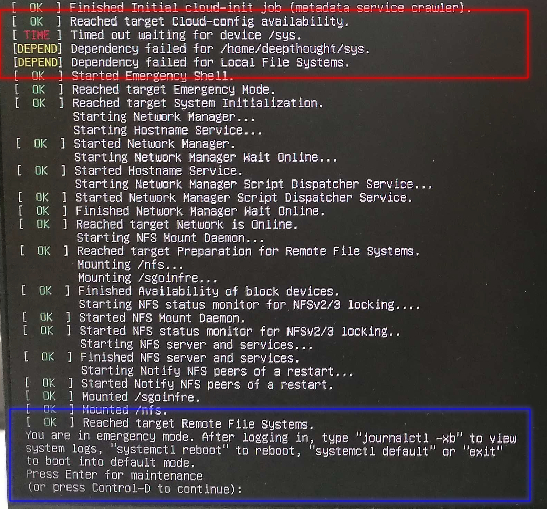

# How I managed to gain _SUDO_ access at 42 School Berlin

## Context
The [42 school](https://en.wikipedia.org/wiki/42_(school)) is a free coding school that is open to anyone who is 18+ years old. It is a peer-to-peer learning school where students learn from each other and work on projects in groups, and there are no teachers. 

There is an archievement called _Hackerman_ to all of those who manage to find a vulnerability in the school's system and report it to the staff. This reinforces the school's security and stimulates students to learn more about security and how to protect themselves from hackers.

This is the report of how I managed to gain sudo access at [42 school Berlin](https://42berlin.de/).

*Steps To Reproduce :*
1. During Boot press *Esc* .
2. Next you will be presented with the _Grub Bootloader_ screen (with 3 options) : 

3. Here is where the complications can occur, since some of the computers have corrupted files during the boot sequence or hardware problems that allow for this kind of attack, falling back to a _recovery mode_ that will allow you to gain root access to the computer.

4. Enter into recovery mode
5. Either restart the computer several times or type nonsense until its forced into recovery mode
6. Once in recovery, you should be presented with the following:

7. And _Boom_ , once you press enter you are given a root shell *(Pwned!)*

8. Once logged in as root, you can add your user to the sudoers file (thanks born2beroot project )

## Hardware and OS information
- Linux Kernel version HERE
- Operating system version info HERE
- Computer HARDWARE models HERE
## Mitigation resources + similar exploits :
* [https://cromwell-intl.com/open-source/linux-break-in-howto.html](https://cromwell-intl.com/open-source/linux-break-in-howto.html)

> Note that Security is not a simple thing, it tends to be some form of an arms race !!
